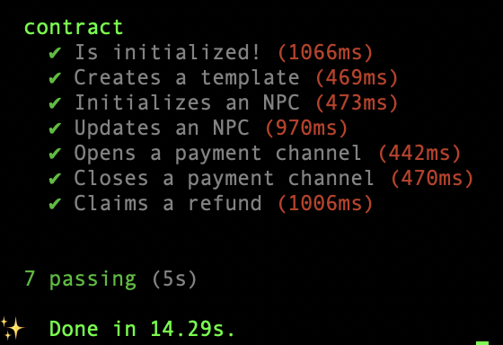

# Decentralized Adaptive NPC (DAN)

DAN is a toolkit for game developers to integrate adaptive, AI-driven NPCs into Sonic SVM-based games. 
It combines a REST API, Sonic smart contract, and Hashed Time Lock (HTLC) payment channels to deliver scalable NPC behavior and secure micro transactions.

## Features

- Reusable NPC templates.
- Verifiable NPC memory and state.
- AI-driven adaptive NPCs dialogue and behaviour.
- Lightling fast micropayments for in-game transactions.

## How It Works

- Anyone can create NPC templates.
- Others can create new NPC using template.
- AI generate NPC dialogue and behavior from onchain memory and state.
- In-game transactions using fast and secure payment channels.
  
## How to test

### Install the following:
- Anchor (v0.29.0)
- Solana CLI (v1.18.26)
- NPM (v11.1.0)
- Node (v23.6.0)
- curl

### Update the .env file

-   Ensure your .env file is configured with the required variables (e.g., SOLANA_RPC_URL, OPENAI_API_KEY, SERVER_SECRET_KEY, etc.).

    ```bash
        SOLANA_RPC_URL=https://api.testnet.sonic.game/
        PROGRAM_ID=FKehpJ8SZkr7XW4tysqoP7N6eLvpG3WASiXZa7JTjWUd
        OPENAI_API_KEY=OpenAI_API_Key
        FEE_ACCOUNT=4GK6rjy5EuuLJ4Xo4fuVjtf7LabxVq2QSJDx3rpqMcHv
        SERVER_SECRET_KEY=Your_Private_Key
        PORT=8000
    ```

## Steps to Test the DAN contract

- Build contract
    ```bash
        anchor build
    ```

- Run local solana validator

    ```bash
        solana-test-validator -r
    ```

- Open another terminal and run

    ```bash
        anchor test --skip-local-validator
    ```

### Expected output



## Steps to Test the APIs Manually

### Start the Server:

- Run the server: `npm run start`.

### Test Health Endpoint:
- Use the curl command for `/health` to verify the server is running.

#### Example
```bash
    curl -X GET http://localhost:8000/health
```

#### Expected Response:
```bash
    {
        "status": "OK",
        "timestamp": "2023-10-05T12:34:56.789Z"
    }
```

### Register a User:
- Use the `/register` endpoint to register a wallet and obtain an API key.
- Save the apiKey for use in authenticated requests.

#### Example
```bash
    curl -X POST http://localhost:8000/register \
    -H "Content-Type: application/json" \
    -d '{"wallet": "YOUR_WALLET_PUBLIC_KEY"}'
```

#### Expected Response:
```bash
    {
        "userId": "YOUR_WALLET_PUBLIC_KEY",
        "apiKey": "550e8400-e29b-41d4-a716-446655440000"
    }
```

### Create an NPC Template:
- Use the `/create-npc-template` endpoint to create a template on the blockchain.
- Verify the transaction on the Solana blockchain (e.g., using Solana Explorer).

#### Example
```bash
    curl -X POST http://localhost:8000/create-npc-template \
    -H "Content-Type: application/json" \
    -H "x-api-key: YOUR_API_KEY" \
    -d '{"templateId": "template1", "name": "Guard", "baseBehavior": "Protect the castle"}'
```

#### Expected Response:
```bash
    {
        "transaction": "TRANSACTION_SIGNATURE"
    }
```

### Create a Payment Channel:
- Send SOL to the **serverWallet.publicKey** using a Solana wallet or CLI command (e.g., solana transfer).
- The server will automatically detect the transfer and create a payment channel (check `channels.json` for the channelId).

### Update an NPC:
- Use the `/update-npc` endpoint with a valid channelId to initialize or update an NPC.
- Check the response for the transaction signature or serialized transaction.

#### Example
```bash
    curl -X POST http://localhost:8000/update-npc \
    -H "Content-Type: application/json" \
    -H "x-api-key: YOUR_API_KEY" \
    -d '{"npcId": "npc1", "gameId": "game1", "action": "attack", "channelId": "CHANNEL_ID", "templateId": "template1"}'
```

#### Expected Response:
```bash
    {
        "transaction": "TRANSACTION_SIGNATURE"
    }
```

### Get NPC State:
- Use the `/get-npc-state` endpoint to retrieve the NPC’s current state.
- Verify the dialogue and behavior match the expected OpenAI response.

#### Example
```bash
    curl -X GET "http://localhost:8000/get-npc-state?npcId=npc1&gameId=game1"
```

#### Expected Response:
```bash
    {
        "dialogue": "Prepare to defend!",
        "behavior": "HOSTILE"
    }
```

- If NPC does not exist, a `404` error will be returned

```bash
    {
    "error": "NPC state not found"
    }
```

### Close the Payment Channel:
- Use the `/close-payment-channel` endpoint to close the channel.
- Verify the transaction on the blockchain and check that the channel is removed from channels.json.

#### Example
```bash
    curl -X POST http://localhost:8000/close-payment-channel \
    -H "Content-Type: application/json" \
    -H "x-api-key: YOUR_API_KEY" \
    -d '{"channelId": "CHANNEL_ID"}'
```

#### Expected Response:
```bash
    {
        "transaction": "TRANSACTION_SIGNATURE",
        "secret": "SECRET_HASH"
    }
```

---

## Note:
- Replace YOUR_API_KEY with your API key.
- Replace CHANNEL_ID with a valid channelId from an existing payment channel (stored in channels.json or created via a blockchain transfer).
- The endpoint deducts 1,000 lamports from the channel balance and updates the NPC state using OpenAI.
- If the NPC doesn’t exist, it will be initialized first, and a transaction signature will be returned.
